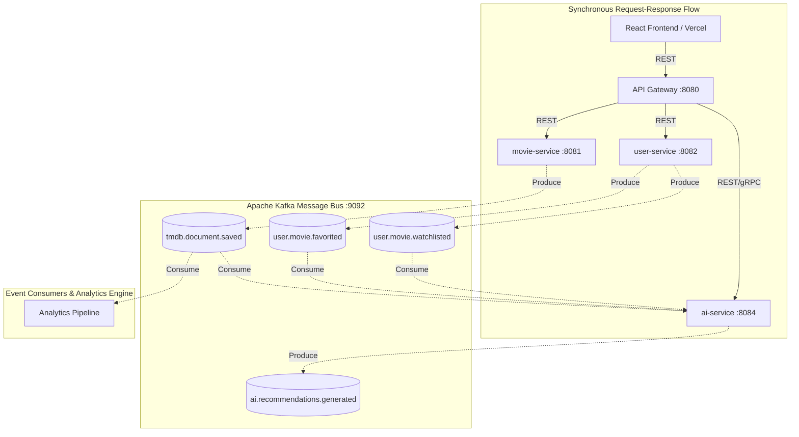

# Event-Driven Architecture Specification

Comprehensive specification of the asynchronous messaging and event-driven architecture within the Filmpire Microservices platform, based on [ADR-006](adr/006-kafka-event-bus.md) and [ARCHITECTURE.md §2.2](ARCHITECTURE.md).

---

## 1. Overview & Architectural Role

Filmpire adopts an asynchronous, event-driven messaging layer powered by **Apache Kafka** to decouple core synchronous user request flows (REST/gRPC) from downstream analytics, audit trails, cache synchronization, and recommendation index updates.



---

## 2. Event Topics & Schemas

All events are formatted in JSON and adhere to a standardized event envelope containing metadata, correlation tracing IDs, and service provenance.

### Standard Event Envelope Schema
```json
{
  "eventId": "UUID",
  "eventType": "String",
  "timestamp": "ISO-8601 UTC",
  "traceId": "String (Zipkin/B3 propagation)",
  "sourceService": "String",
  "payload": { ... }
}
```

### Topic Registry

| Topic Name | Producer Service | Key Schema | Payload Description | Consumers |
|---|---|---|---|---|
| `tmdb.document.saved` | `movie-service`, `actor-service` | `tmdbId` (String) | Emitted whenever a movie or actor is persisted into local MongoDB/PostgreSQL after a TMDB read-through fetch. Contains metadata and genres. | `ai-service` (vector indexing), Analytics |
| `user.movie.favorited` | `user-service` | `userId` (UUID) | Emitted when a user adds or removes a movie from their favorites list. | `ai-service` (taste profile updates) |
| `user.movie.watchlisted` | `user-service` | `userId` (UUID) | Emitted when a user toggles a movie in their watchlist. | `ai-service` (taste profile updates) |
| `ai.recommendations.generated` | `ai-service` | `userId` (UUID) | Emitted when personalized recommendations or chat inferences complete. | Analytics, Telemetry |

---

## 3. Producer & Consumer Guarantees

### 3.1 Producer Resilience & Idempotence
- **`acks=all`**: Guarantees leader and replica persistence before acknowledging write.
- **`enable.idempotence=true`**: Ensures exactly-once delivery semantics at the broker boundary, preventing duplicate message ingestion during network retries.
- **Compression**: `snappy` compression enabled for efficient bandwidth utilization.

### 3.2 Consumer Group & Partitioning Strategy
- **Partition Key**: Events are partitioned by entity ID (`userId` or `tmdbId`) to guarantee in-order delivery of state changes for any individual entity.
- **Consumer Offsets**: Committed automatically on successful processing completion (`enable.auto.commit=false` with Spring Kafka `AckMode.RECORD`).

---

## 4. Local Profile vs. Cloud Topology

| Environment | Kafka Deployment Strategy | Configuration |
|---|---|---|
| **Local Development (Compose)** | Single-broker KRaft cluster (`confluentinc/cp-kafka:7.7.1`) on port `9092`. | Enabled via standard `docker-compose.yml`. |
| **Testing (Testcontainers)** | `org.testcontainers:kafka` spins up ephemeral container for contract tests. | Enabled in test suites with `@ServiceConnection`. |
| **Ephemeral Cloud (AKS / k3s)** | **Zero-Cost Profile:** Kafka is kept out of minimal $0 cloud overlays ([ADR-005](adr/005-eureka-config-vs-kubernetes-native.md)), allowing direct synchronous operation while maintaining full code readiness. | Managed via Spring profile configuration. |

---

## 5. Error Handling & Dead Letter Queues (DLQ)

When an event handler encounters a non-transient deserialization or database error:
1. Spring Kafka `DefaultErrorHandler` executes exponential backoff (1s, 2s, 4s).
2. If retries are exhausted, the message is routed to `.DLT` (Dead Letter Topic):
   - Example: `tmdb.document.saved.DLT`
3. Alarms fire via Micrometer metrics (`kafka.consumer.failure.count`).
