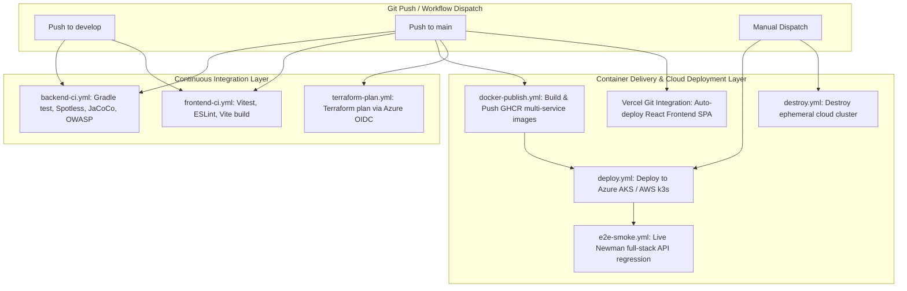

# GitOps, CI/CD Pipelines & Cloud Automation Runbook

Comprehensive reference for the continuous integration, container publishing, zero-budget cloud automation, and GitOps workflows configured in the Filmpire Microservices repository.

---

## 1. Pipeline Architecture Overview

The CI/CD subsystem is implemented with **GitHub Actions** and local Gradle orchestration tasks.



---

## 2. GitHub Actions Workflow Catalog

| Workflow File | Trigger | Purpose & Execution Steps | Target Environment |
|---|---|---|---|
| [`.github/workflows/backend-ci.yml`](../../.github/workflows/backend-ci.yml) | `push`, `pull_request` (`backend/**`, `build.gradle`, `gradle.properties`) | Sets up Java 25 via SDKMAN/Temurin, executes `./gradlew test jacocoTestReport spotlessCheck owaspDependencyCheck`. | CI Runner (Ubuntu 24.04) |
| [`.github/workflows/frontend-ci.yml`](../../.github/workflows/frontend-ci.yml) | `push`, `pull_request` (`frontend/**`) | Installs Node.js 22, executes `npm run test` (Vitest), `npm run lint`, and `npm run build`. | CI Runner (Ubuntu 24.04) |
| [`.github/workflows/docker-publish.yml`](../../.github/workflows/docker-publish.yml) | `push` to `main` | Builds Docker images for all 8 microservices and publishes them to GitHub Packages (`ghcr.io/pehlivanu/filmpire-*:latest`). | GitHub Container Registry (GHCR) |
| [`.github/workflows/terraform-plan.yml`](../../.github/workflows/terraform-plan.yml) | `push` to `main` (`infrastructure/terraform/**`) | Authenticates to Azure via GitHub OIDC federation (no stored secrets) and verifies Terraform plan syntax. | Azure Resource Manager |
| [`.github/workflows/deploy.yml`](../../.github/workflows/deploy.yml) | `workflow_dispatch` (Choice: `azure` / `aws`) | Provisions Terraform infrastructure, applies Kubernetes Kustomize manifests, updates DuckDNS records, and launches smoke tests. | Azure AKS / AWS EC2 k3s |
| [`.github/workflows/destroy.yml`](../../.github/workflows/destroy.yml) | `workflow_dispatch` (Choice: `azure` / `aws`) | Destroys cloud infrastructure via Terraform to maintain $0 spend. | Cloud Providers |
| [`.github/workflows/e2e-smoke.yml`](../../.github/workflows/e2e-smoke.yml) | Nightly cron / `workflow_dispatch` | Spawns complete stack and executes Newman collection (`Filmpire-API.postman_collection.json`). | CI Runner |

---

## 3. Secret & Variable Matrices

### 3.1 GitHub Repository Variables (Public Metadata)
- `AZURE_CLIENT_ID`: App registration client ID for Azure OIDC.
- `AZURE_TENANT_ID`: Azure Active Directory tenant ID.
- `AZURE_SUBSCRIPTION_ID`: Target Azure subscription ID.
- `AWS_ROLE_ARN`: IAM role ARN with OIDC trust policy.
- `AWS_REGION`: AWS deployment region (default: `us-east-1`).
- `TF_STATE_RESOURCE_GROUP` / `TF_STATE_STORAGE_ACCOUNT` / `TF_STATE_CONTAINER`: Azure remote state backend.
- `TF_STATE_BUCKET` / `TF_STATE_TABLE`: AWS S3 & DynamoDB remote state backend.
- `ALERT_EMAIL`: Email recipient for zero-spend tripwire alerts.

### 3.2 GitHub Repository Secrets (Sensitive Credentials)
- `TMDB_API_KEY`: API key for upstream TMDB v3 data hydration.
- `DUCKDNS_TOKEN`: Token for updating `filmpire-api.duckdns.org`.
- `AWS_K3S_SSH_PRIVATE_KEY`: Private SSH key for fetching `kubeconfig` over SSH from AWS k3s nodes.

---

## 4. Local Gradle Orchestration Tasks

For quick local developer operations without opening the GitHub Actions UI:

```bash
# Infrastructure Lifecycle
./gradlew deployLocal        # Boots local Docker Compose (15 services)
./gradlew stopLocal          # Stops local Docker Compose
./gradlew statusInfra        # Checks health of all running containers

# Cloud Lifecycle
./gradlew deployAzure        # Runs infrastructure/scripts/deploy-azure.sh
./gradlew destroyAzure       # Runs infrastructure/scripts/destroy-azure.sh
./gradlew deployAws          # Runs infrastructure/scripts/deploy-aws.sh
./gradlew destroyAws         # Runs infrastructure/scripts/destroy-aws.sh

# Tunneling
./gradlew startTunnel        # Spawns Cloudflare Tunnel & updates tunnel-url.txt
```

---

## 5. Zero-Budget Cost Guard & Tripwire Policy

To prevent unexpected billing on cloud accounts:
1. **$1 Budget Alarm**: Applied before any compute resources are provisioned (`budget-guard` and `budget-guard-aws` Terraform modules).
2. **Standard Load Balancer & NAT Gateway Avoidance**: Direct node public IP routing via NodePort `30080`.
3. **Prompt Destroy Policy**: Cloud clusters are ephemeral and torn down immediately after testing sessions.
