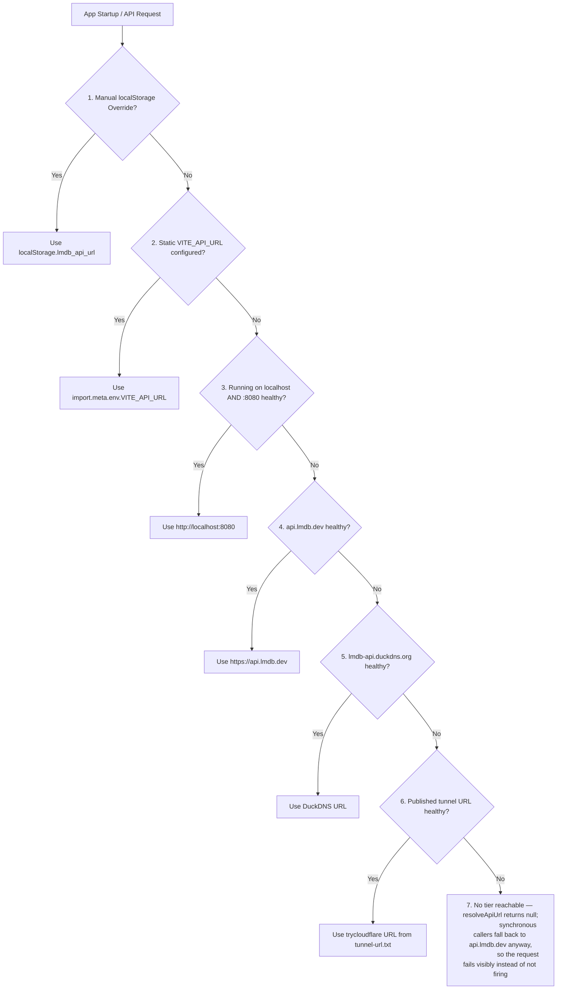
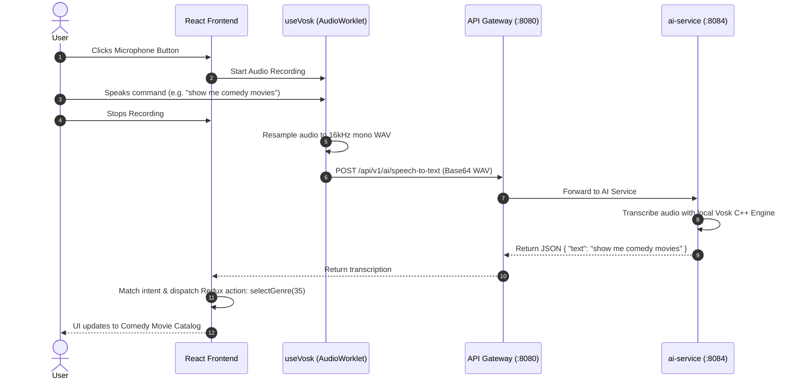

# LMDB Frontend Architecture Specification

Comprehensive technical specification for the LMDB web application (`frontend/lmdb`), detailing UI component architecture, Redux state management, RTK Query caching policies, dynamic backend auto-discovery, offline voice recognition, and testing methodology.

---

## 1. Architectural Overview & Design Philosophy

The LMDB frontend is a single-page application (SPA) built with **React 19**, **Vite**, **Material-UI v9 (MUI)**, and **Redux Toolkit Query (RTKQ)**. 

### Core Design Goals
1. **TMDB Drop-in Replacement:** The frontend interacts with backend APIs using standard TMDB v3 API signatures (`/movie/{id}`, `/genre/movie/list`, `/discover/movie`, `/search/movie`, `/person/{id}`) as defined in [ADR-003](../../docs/architecture/adr/003-tmdb-raw-passthrough-facade.md) and [ADR-010](../../docs/architecture/adr/010-tmdb-facade-mapped-persisted-schema.md).
2. **Dynamic Backend Auto-Discovery:** Fronted by Cloudflare tunnels or Kubernetes NodePorts, the SPA discovers its live backend dynamically at runtime without requiring client bundle rebuilds ([ADR-016](../../docs/architecture/adr/016-dynamic-backend-resolution.md)).
3. **$0 Speech-to-Text Voice Control:** Enables hands-free voice commands transcribed natively by the backend `ai-service` via Vosk ([ADR-012](../../docs/architecture/adr/012-ai-service-postgresql-pgvector.md)).
4. **Resilient Offline Caching:** Employs RTK Query memory caching and optimistic updates for smooth navigation across movie catalogs, actors, and user profiles.

---

## 2. Directory Structure & Component Hierarchy

```
frontend/lmdb/
├── index.html                    # Root HTML template with viewport & Google Fonts
├── vite.config.js                # Vite build configuration (Port 5173 / 3000, alias mapping)
├── src/
│   ├── index.js                  # React DOM root render & ThemeProvider wrapper
│   ├── components/               # Reusable presentation and layout components
│   │   ├── App.jsx               # Root layout, routing definition, and main toolbar
│   │   ├── Navbar/               # Responsive navigation bar with search & auth
│   │   ├── Sidebar/              # Genre & category drawer navigation
│   │   ├── Movies/               # Main movie grid and pagination view
│   │   ├── Movie/                # Individual movie card with poster & ratings
│   │   ├── MovieList/            # Responsive CSS grid wrapper for Movie cards
│   │   ├── MovieInformation/     # Detailed movie view (trailers, cast, recommendations)
│   │   ├── Actors/               # Actor bio, profile photo, and filmography list
│   │   ├── Profile/              # User profile, favorites list, and watchlist
│   │   ├── Recommendations/      # AI-generated picks from the user's own Favorites (#220-#221)
│   │   ├── Search/               # Autocomplete search input with debouncing
│   │   ├── RatedCards/           # Horizontal / grid display for rated movies
│   │   └── AlanVoice/            # Voice assistant control widget (Vosk modal)
│   ├── features/                 # Redux Toolkit state slices
│   │   ├── auth.js               # Authentication state, user profile, and session tokens
│   │   └── currentGenreOrCategory.js # Active genre filter and search query state
│   ├── services/                 # RTK Query API slices
│   │   └── TMDB.js               # TMDB v3 API query hooks and endpoint definitions
│   ├── utils/                    # Shared utilities and helper functions
│   │   ├── apiUrl.js             # Dynamic runtime backend discovery engine
│   │   ├── useVosk.js            # Voice recording and Vosk STT audio processing
│   │   └── index.js              # Authentication and TMDB token exchange helpers
│   └── app/
│       └── store.js              # Central Redux store configuration & middleware
```

---

## 3. Dynamic Backend URL Auto-Discovery Engine

To support zero-cost ephemeral cloud deployments and local tunneling without modifying production builds, [`src/utils/apiUrl.js`](src/utils/apiUrl.js) resolves the backend URL per request through a 7-tier cascading resolver, each tier gated behind a live `/actuator/health` check except the first two (which are explicit overrides, trusted without probing):



This is the exact tier order implemented in `apiUrl.js` today — kept in
one place ([ARCHITECTURE.md §11.6](../../docs/architecture/ARCHITECTURE.md#116-dynamic-backend-resolution-one-frontend-deploy-any-live-backend)
has the same diagram with the reasoning behind each tier) rather than
re-described independently in every doc that touches deployment, which is
how an earlier version of this diagram drifted to a different order than
the code (it listed the tunnel before localhost, and ended in a
`themoviedb.org` fallback that was never implemented).

---

## 4. State Management Architecture

### 4.1 Redux Store (`src/app/store.js`)
The central store integrates Redux Toolkit slices with RTK Query middleware:

```javascript
import { configureStore } from '@reduxjs/toolkit';
import { tmdbApi } from '../services/TMDB';
import genreOrCategoryReducer from '../features/currentGenreOrCategory';
import userReducer from '../features/auth';

export default configureStore({
  reducer: {
    [tmdbApi.reducerPath]: tmdbApi.reducer,
    currentGenreOrCategory: genreOrCategoryReducer,
    user: userReducer,
  },
  middleware: (getDefaultMiddleware) =>
    getDefaultMiddleware().concat(tmdbApi.middleware),
});
```

### 4.2 RTK Query API Slice (`src/services/TMDB.js`)
Endpoints map 1:1 to TMDB v3 API paths:

| RTK Hook | HTTP Method & Path | Purpose |
|---|---|---|
| `useGetGenresQuery` | `GET /genre/movie/list` | Fetches movie genre taxonomy |
| `useGetMoviesQuery` | `GET /discover/movie`, `/movie/popular`, `/movie/top_rated`, `/movie/upcoming`, `/search/movie` | Retrieves movie collections filtered by genre, category, or search query |
| `useGetMovieQuery` | `GET /movie/{id}?append_to_response=videos,credits` | Hydrates movie details, trailers, and cast |
| `useGetRecommendationsQuery` | `GET /movie/{id}/recommendations` | Fetches similar and recommended movies |
| `useGetActorsDetailsQuery` | `GET /person/{id}` | Fetches actor biography, birthday, and photo |
| `useGetMoviesByActorIdQuery` | `GET /discover/movie?with_cast={id}` | Retrieves actor filmography |
| `useGetListQuery` | `GET /account/{id}/favorite/movies`, `/account/{id}/watchlist/movies` | Fetches user favorites and watchlist |

---

## 5. Vosk Offline Voice Assistant Architecture

Voice control operates with $0 third-party cloud API costs by offloading speech transcription to the microservice backend:



### Supported Voice Command Grammar
- **Genre Navigation:** `"action"`, `"comedy"`, `"horror"`, `"animation"`, `"drama"`, `"sci-fi"`, `"thriller"`, etc.
- **Category Navigation:** `"popular"`, `"top rated"`, `"upcoming"`.
- **Search Execution:** `"search [Movie Name]"` (e.g., *"search interstellar"*).
- **Theme Control:** `"light mode"`, `"dark mode"`, `"toggle theme"`.
- **Authentication:** `"log out"`, `"sign out"`.

---

## 6. Build, Testing & Deployment

### Build Configuration (`vite.config.js`)
- Fast HMR with `@vitejs/plugin-react`.
- Source map generation and chunk splitting.
- Configured default port: `5173` (with `3000` fallback).

### Testing Methodology
- **Vitest 4 + React Testing Library:** Over 180 component and hook unit tests verifying rendering, user interactions, Redux actions, and RTK Query hooks.
- **Run tests:** `npm test`
- **Coverage report:** `npm run test:coverage`

### Production Deployment
- Continuous deployment via Vercel Git integration: [https://lmdb.dev/](https://lmdb.dev/)
